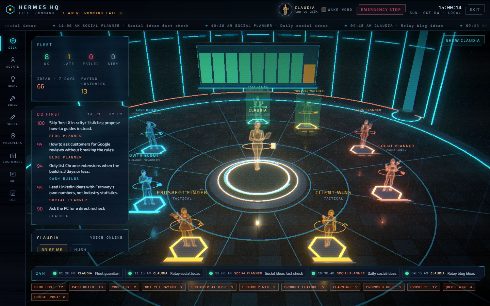
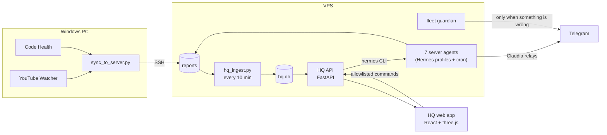
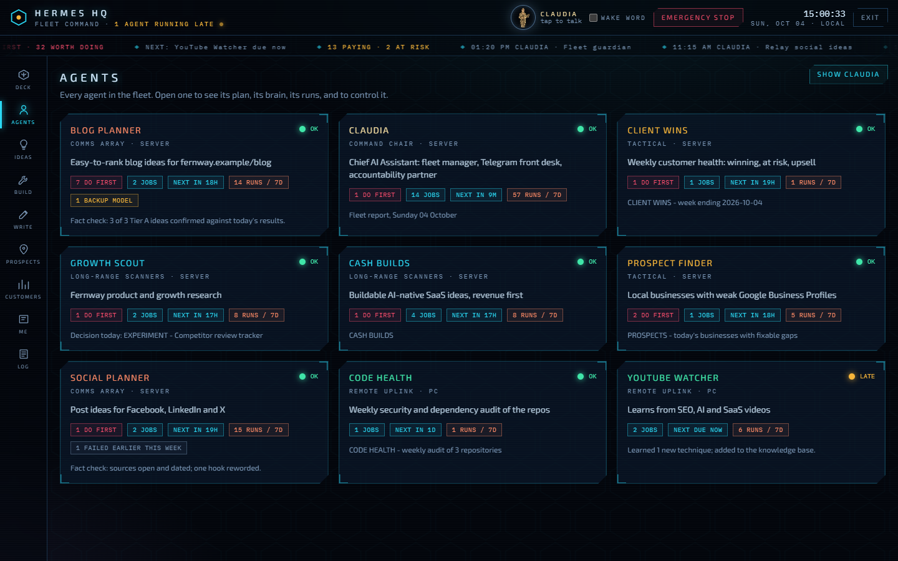
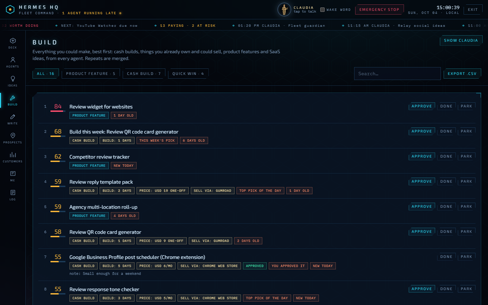
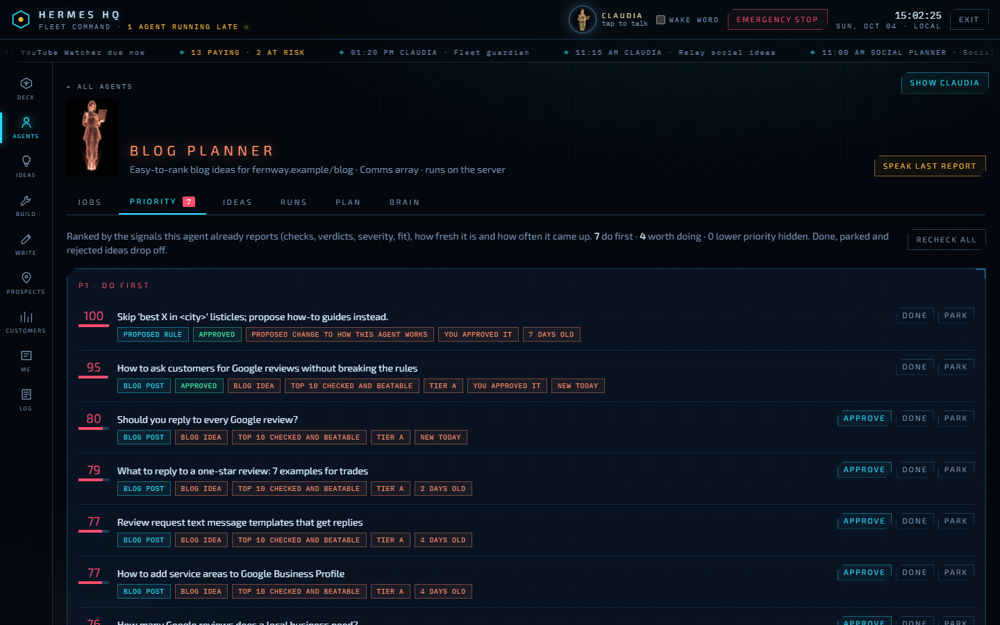
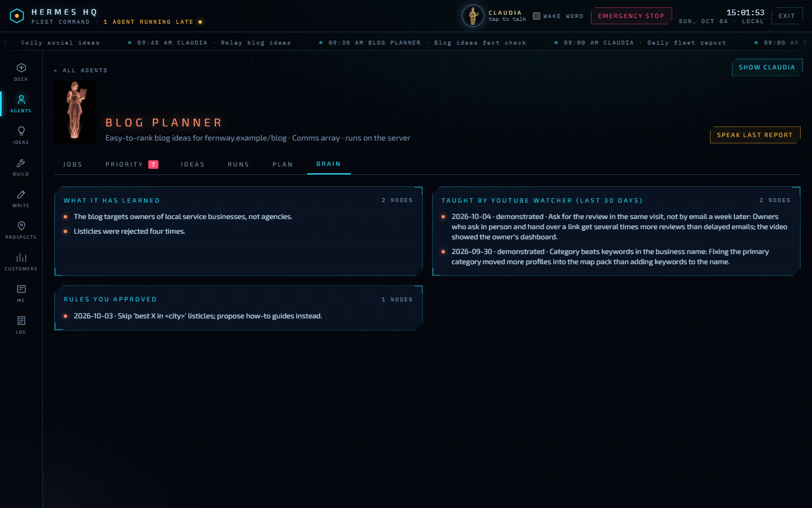
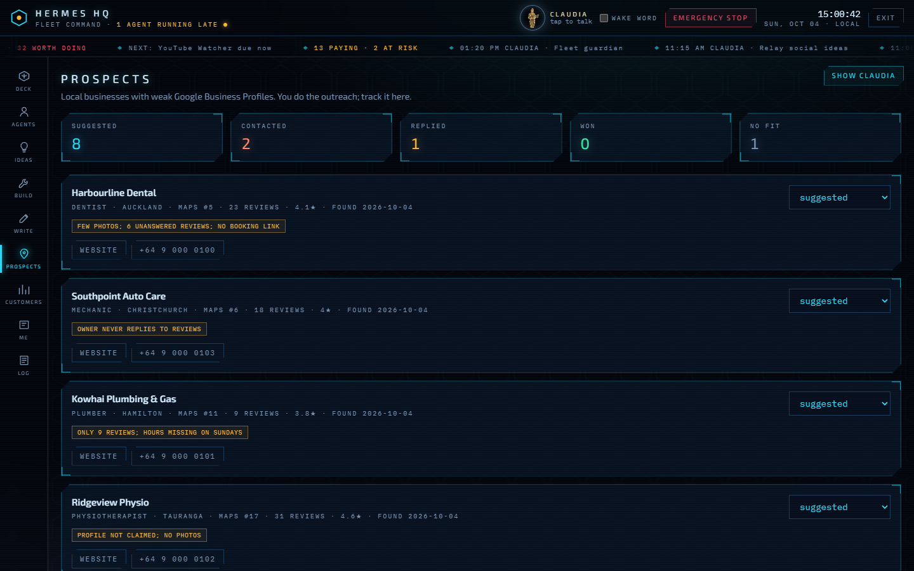
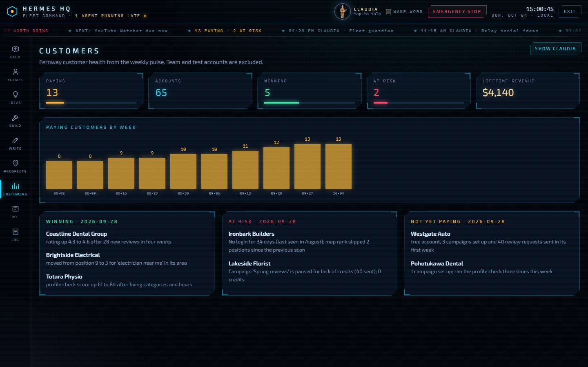

# AI Employees

Nine AI agents that run a small software business's research, marketing, sales and ops on a schedule, and the dashboard I use to manage them.

I built this fleet for my own company and have run it every day since. This repository is the public copy. The company is replaced by **Fernway**, a made-up local-marketing app, and every customer, prospect and number in the demo is invented. The agents, scripts, prompts, parsers and dashboard are the real ones.



## What it does

| Employee | Runs on | Job |
|---|---|---|
| **Claudia** (chief of staff) | VPS | Telegram front desk. Relays every report, runs morning and evening check-ins, the fleet guardian, and the weekly tune-up that improves the other agents |
| **Cash Builds** | VPS | Small tools one developer could build in five days and sell, with evidence that people pay for them |
| **Growth Scout** | VPS | Market changes and customer pain, each turned into a verdict: BUILD, EXPERIMENT, CONTENT, WATCH or NO ACTION |
| **Blog Planner** | VPS | Blog topics the site can rank for, checked against the live search results. A second job fact-checks them 30 minutes later |
| **Social Planner** | VPS | Post ideas per platform, with sources. Also fact-checked |
| **Prospect Finder** | VPS | Local businesses with fixable Google Business Profile gaps, for manual outreach |
| **Client Wins** | VPS | Weekly customer health: who is winning, who is at risk, who is ready to upgrade |
| **YouTube Watcher** | PC | The fleet's teacher. Watches channels, transcribes videos, grades each technique (VERIFIED, DEMONSTRATED, CLAIMED) and routes it to the agents it helps |
| **Code Health** | PC | Weekly dependency and security audit of the repositories |

There are **29 scheduled jobs** in [fleet/jobs.yaml](fleet/jobs.yaml). Eight of them use no model: a script's output is the whole message (relays, the guardian, the prospect and customer collectors).

## How it works



- **Agents are [Hermes Agent](https://github.com/NousResearch/hermes-agent) profiles.** Each has a `SOUL.md` (its instructions) and cron jobs. This repo holds the profiles, scripts and dashboard, not Hermes itself.
- **Collect first, then reason.** Every job runs a Python *collector* before the model starts: it fetches feeds, search results, repository data or customer metrics and prints compact text that goes into the prompt. The model only works with facts it was given, and every claim must name its source.
- **Reports become data with no model involved.** [hq_ingest.py](hq/server/hq_ingest.py) copies every report into SQLite. [hq_parsers.py](hq/server/hq_parsers.py) turns each agent's report format into idea rows by copying text exactly. A report that fails to parse is still stored and can be re-parsed later.
- **One ranked list.** [hq_priority.py](hq/server/hq_priority.py) scores every open idea from 0 to 100 using signals the agents already report: search-result checks, verdicts, severities, rank gaps and evidence grades. Each point carries a plain-English reason. It is deterministic, so the same idea gets the same score on the same day.
- **The fleet improves itself, with the founder approving.** Each Sunday, Claudia reads what was approved, rejected and parked, plus what YouTube Watcher learned. She proposes a few rules. Approving one in HQ appends it to that agent's `SOUL.md`, after keeping a dated backup. Rejecting it removes the rule again.

More detail in [docs/architecture.md](docs/architecture.md).

## The dashboard (Hermes HQ)

| | |
|---|---|
|  |  |
| Every agent's health, next run and last report | Everything worth building, from every agent, ranked with reasons |
|  |  |
| One agent's ranked findings, with approve, done and park | What the agent remembers, what YouTube Watcher taught it, and the rules the founder approved |
|  |  |
| Prospects to contact, tracked from suggested to won | Weekly customer health: winning, at risk, not yet paying |

**Claudia has a voice.** Press the orb or say the wake word and ask "what should I do first?" or "open prospects". She answers out loud as a lip-synced 3D avatar (TalkingHead). Neural voices report word timings, which keeps the lip-sync exact, and an offline voice is the fallback. She can only *suggest* actions. The API drops any action that is not on its allowlist, and the page asks you to confirm before anything runs.

**Security.** The dashboard can change a live system, so it is guarded:

- **Login:** a password (PBKDF2) plus a 6-digit code that Claudia sends to Telegram. The API never holds the bot token.
- **Sessions:** HTTP-only, SameSite=Strict cookies.
- **Request checks:** a CSRF header on every write, and a limit of 10 login attempts per 15 minutes.
- **Allowed commands:** the only Hermes commands HQ can run are `run`, `pause`, `resume`, a validated schedule edit and the emergency stop. Every change, including idea decisions, is written to the audit log.

## Run the demo

It runs on any machine with Python 3.11+ and Node 20+. There is no Hermes install, no model, and nothing is sent anywhere.

```bash
pip install -r hq/server/requirements.txt
python hq/demo/seed.py                    # writes made-up fleet files, then runs the real ingest

cd hq/server
HQ_DEMO=1 HQ_HOME=../demo/home uvicorn hq_api:app --port 8787      # PowerShell: $env:HQ_DEMO=1; $env:HQ_HOME="../demo/home"

cd ../web && npm ci && npm run dev        # http://localhost:5173, access key: demo
```

In demo mode the login screen shows the code instead of sending it to Telegram. A small rule-based stand-in plays Claudia, and its answers still go through the same allowlist. Job controls edit the demo's `jobs.json` the way the Hermes CLI would. Claudia's 3D avatar needs a GLB file that is not included (see [docs/setup.md](docs/setup.md)); without it she still speaks.

## What running it taught me

The full list, with fixes, is in [docs/incidents.md](docs/incidents.md). The short version:

- **A fallback model is a silent failure.** When the main model's quota ran out, runs carried on with a backup model, and the reports looked fine but contained invented numbers. Now every fallback run is detected, flagged in HQ and Telegram, and fact-checked.
- **Agents repeat themselves.** One scout recommended four versions of the same idea in a row. A memory of past picks (from the database, not the model) and a daily topic rotation fixed it.
- **Parse reports with code, not a model.** Plain parsers that copy text exactly made every idea traceable to the report it came from.
- **The model's "thinking aloud" leaks.** Lines like "Let me check the results" became ideas until ingest learned to cut everything before the report's first heading.
- **Make health checks quiet.** The guardian prints nothing when the fleet is healthy, so its messages are always worth reading.

## Repository

```
employees/<agent>/   SOUL.md (instructions), collectors, configs
fleet/jobs.yaml      every scheduled job: agent, cron, script, prompt, delivery
hq/server/           FastAPI API, ingest, parsers, priority scorer, demo stand-ins
hq/web/              React 19 + TypeScript + react-three-fiber dashboard
hq/blender/          builds the 3D deck (deck.glb) from code
hq/demo/seed.py      the made-up fleet for the demo
ops/pc/              Windows-side scheduling: PC retries and HQ recheck requests
tests/               parsers, priority, guardian, and the API in demo mode
```

```bash
pip install -r hq/server/requirements.txt pytest && pytest      # 41 tests
cd hq/web && npm ci && npm run lint && npm run build
```

## Credits

Built on [Hermes Agent](https://github.com/NousResearch/hermes-agent) by Nous Research. The dashboard uses [three.js](https://threejs.org), [react-three-fiber](https://github.com/pmndrs/react-three-fiber) and [TalkingHead](https://github.com/met4citizen/TalkingHead). Full notices are in [NOTICE](NOTICE).

MIT licensed.
