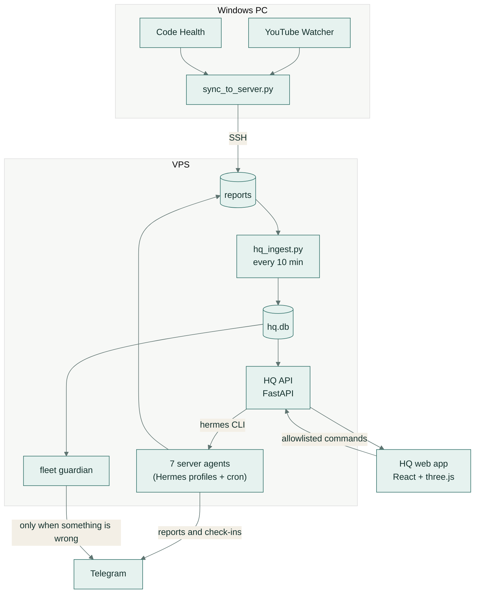
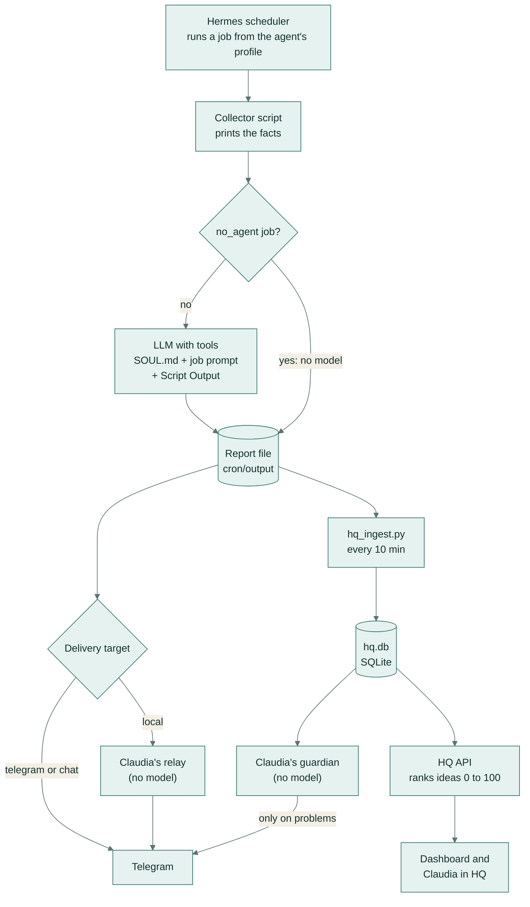

# AI Employees

Nine AI agents ("employees") that do the research, marketing, sales and operations work of a small software business on a schedule, and **Hermes HQ**, the dashboard where the founder reviews and steers them. Every report reaches the founder's phone through Telegram. HQ turns the reports into one ranked to-do list, shows the fleet on a 3D command deck, and has Claudia, a chief assistant you can talk to. It is built for a solo founder: the agents research and recommend, and the founder decides.


*The command deck (demo data): fleet health, the ranked "Do first" list, each agent at its station and the last 24 hours of runs.*

I built this fleet for my own company, where it runs every day. In this public copy the company is **Fernway**, a fictional local-marketing app, and every customer, prospect and number in the demo is invented. The agents, scripts, prompts, parsers and dashboard are the real ones.

## Key features

- **Nine agents, 29 scheduled jobs.** Market research, build ideas, blog and social ideas, sales prospects, customer health, code audits and a chief of staff. Each agent is a [Hermes Agent](https://github.com/NousResearch/hermes-agent) profile with its own instructions (`SOUL.md`) and cron jobs.
- **Collect first, then reason.** A Python collector fetches the facts before the model starts. The model works from those facts and must name a source for every claim. Eight jobs run with no model at all.
- **Fact-checked content.** Blog and social ideas are drafted, then reviewed 30 minutes later by a fact-check job that removes anything it cannot confirm.
- **Reports become data without a model.** Plain parsers turn every report into idea rows in SQLite by copying text exactly, and the full report is always stored.
- **One ranked list.** A deterministic scorer rates every open idea from 0 to 100, with a plain-English reason for each point.
- **A fleet that improves itself, with approval.** Every Sunday Claudia proposes rules from the founder's decisions and YouTube Watcher's learnings. Approving one in HQ writes it into that agent's `SOUL.md`.
- **Telegram on the phone.** Reports, daily and weekly reviews, check-ins, and a guardian that only speaks when something is wrong.
- **Hermes HQ.** A 3D command deck, ranked build and write boards, prospect and customer views, a page per agent, CSV and Excel exports, and an audit log.
- **Claudia by voice.** Push to talk or say "Claudia". She answers out loud as a lip-synced 3D avatar, and any action she suggests passes an allowlist and your confirmation.
- **Runs anywhere as a demo.** `HQ_DEMO=1` swaps Telegram, the Hermes CLI and the model for local stand-ins, on made-up data loaded by the real ingest.

## The employees

| Employee | Runs on | Job |
|---|---|---|
| **Claudia** (chief of staff) | VPS | Telegram front desk. Relays reports, writes the daily fleet report, runs morning and evening check-ins, the fleet guardian, and the weekly tune-up that improves the other agents |
| **Cash Builds** | VPS | Small tools one developer could build in five days and sell, with evidence that people pay for them |
| **Growth Scout** | VPS | Market changes and customer pain, each turned into a verdict: BUILD, EXPERIMENT, CONTENT, WATCH or NO ACTION |
| **Blog Planner** | VPS | Blog topics the site can rank for, checked against the live search results. A second job fact-checks them 30 minutes later |
| **Social Planner** | VPS | Post ideas per platform, with sources. Also fact-checked |
| **Prospect Finder** | VPS | Local businesses with fixable Google Business Profile gaps, for manual outreach |
| **Client Wins** | VPS | Weekly customer health: who is winning, who is at risk, who is ready to upgrade |
| **YouTube Watcher** | PC | The fleet's teacher. Watches channels, transcribes videos, grades each technique (VERIFIED, DEMONSTRATED, CLAIMED) and routes it to the agents it helps |
| **Code Health** | PC | Weekly dependency and security audit of the repositories |

[fleet/jobs.yaml](fleet/jobs.yaml) lists all **29 scheduled jobs**, three of them paused. Eight use no model: the script's output is the whole message (Claudia's relays, the guardian, and the prospect and customer collectors).

## Architecture



- **VPS:** seven agents as Hermes profiles with cron jobs, Claudia's relays and guardian, and HQ: the API (Uvicorn behind nginx), the ingest (cron, every 10 minutes) and the SQLite database.
- **Windows PC:** YouTube Watcher, because YouTube blocks datacenter IPs, and Code Health, because the repositories live on the PC. [sync_to_server.py](employees/youtube-watcher/sync_to_server.py) pushes their reports to the server over SSH. The server never connects to the PC.
- **Browser:** the HQ web app talks only to the HQ API. Job and fleet controls go through a short allowlist of Hermes CLI commands, and every change is written to the audit log.
- **Phone:** Telegram, through Claudia's Hermes profile.

## How it works

One scheduled run, from the timer to the founder's phone and the dashboard:



1. **Schedule.** Each job lives in its agent's Hermes profile (`cron/jobs.json`) with a cron schedule, a pre-run script, a prompt and a delivery target. [fleet/jobs.yaml](fleet/jobs.yaml) lists every job. Hermes' scheduler starts each one at its time.
2. **Collect.** The pre-run collector does the work that must be exact: feeds, search results and suggestions, live Google Maps results, OSV.dev advisories, customer metrics. Hermes puts its output in the prompt under "Script Output". The two scouts also get a novelty block from `hq.db` (today's topic lane and every pick of the last 30 days, from [scout_memory.py](hq/server/scout_memory.py)), and Blog Planner and the scouts get what YouTube Watcher learned for them ([learnings.py](hq/server/learnings.py)).
3. **Reason.** The model works from the agent's `SOUL.md`, the job prompt and the Script Output, with tools such as web search, helper scripts and the agent's own files. Blog Planner, for example, reads the live top 10 for a query and runs `dr_check.py` on those sites before it calls a topic winnable. Every claim must name its source. In a `no_agent` job, the script's output is the whole message and no model runs.
4. **Report.** Hermes saves the run as a Markdown file under `~/.hermes/profiles/<agent>/cron/output/<job id>/`. PC agents' reports are copied to `~/agents/<agent>/pc-reports/` on the server by the sync.
5. **Deliver.** Claudia's jobs and some agents send to Telegram or a named chat directly. Agents that deliver `local` are forwarded by Claudia's no-model relay jobs. For blog and social ideas the relay sends the fact-checked version when it is newer than the draft, and it labels unchecked drafts and backup-model runs.
6. **Ingest.** Every 10 minutes [hq_ingest.py](hq/server/hq_ingest.py) copies new reports into `hq.db`: status, run time, a backup-model flag, the headline and the full body. Agent-specific parsers in [hq_parsers.py](hq/server/hq_parsers.py) turn each report into idea rows. A report that fails to parse is still stored and can be re-parsed later.
7. **Rank and show.** The HQ API scores every open idea with [hq_priority.py](hq/server/hq_priority.py): P1 at 70 or more (do first), P2 from 50 to 69. The dashboard shows the ranked lists, and Claudia answers questions from the same live picture.
8. **Watch.** Three times a day the [fleet guardian](employees/claudia/scripts/fleet_guard.py) reads `hq.db` for failed, late or backup-model runs, a stalled ingest, services that are down, a full disk or a stale PC sync. It prints nothing when all is well, so Claudia only sends a message when something needs attention.

### The founder decides

Ideas are approved, marked done, parked or rejected in HQ, and every decision lands in the audit log and in a decisions file that Claudia reads in her reviews. Each Sunday, Claudia's tune-up reads what was approved, rejected and parked, plus what YouTube Watcher learned, and proposes a few rules for the four agents that can be tuned. Approving a rule in HQ appends it to that agent's `SOUL.md`, after keeping a dated backup. Rejecting or parking it removes the rule again.

More detail in [docs/architecture.md](docs/architecture.md).

## Screenshots

The dashboard screenshots show the demo's fictional data.

| | |
|---|---|
|  |  |
| **Agents.** Every agent's health, jobs, next run, "do first" count and the headline of its latest report. | **Build board.** Everything worth building, from every agent, ranked with its reasons. Repeats are merged. |
|  |  |
| **Agent priority.** One agent's ranked findings, with approve, done, park and recheck. | **Agent brain.** What the agent remembers, what YouTube Watcher taught it, and the rules the founder approved. |
|  |  |
| **Prospects.** Local businesses with fixable profile gaps, tracked from suggested to won. | **Customers.** Weekly customer health: paying customers by week, and who is winning, at risk or not yet paying. |


**Claudia's avatar.** A 3D TalkingHead avatar appears while she thinks and speaks, with lip-sync, blinking and eye contact. Neural voices (edge-tts) report where each word starts, which keeps the lip-sync exact. The offline Kokoro voice is the fallback, and the browser's own speech is the last resort.

The avatar model itself is not part of this repository. Add your own GLB as described in [docs/setup.md](docs/setup.md#claudias-avatar). Without it, Claudia still speaks.

<br clear="right">

## Tech stack

| Layer | Technology |
|---|---|
| Agents | Hermes Agent profiles and cron, Python collectors, Telegram |
| Data sources | DataForSEO (Maps), OSV.dev, YouTube feeds and transcripts, Google autocomplete, web search through `ddgs`, GitHub API |
| HQ server | Python, FastAPI, Uvicorn, Pydantic, SQLite (WAL mode), openpyxl, PyYAML. Optional voices: edge-tts, kokoro-onnx |
| HQ web | React 19, TypeScript, Vite, Tailwind CSS, React Router, react-three-fiber, drei, postprocessing, three.js, TalkingHead |
| 3D assets | Blender, scripted in Python ([build_deck.py](hq/blender/build_deck.py)) and exported as glTF |
| Hosting | Linux VPS with nginx, a systemd user service and cron. Windows PC with Task Scheduler and SSH |
| Quality | pytest, Ruff, ESLint, TypeScript, GitHub Actions |

## Getting started

### Prerequisites

- **Demo:** Python 3.11 or newer and Node 20 or newer. Nothing else: no Hermes install, no model, no Telegram.
- **The real fleet:** [Hermes Agent](https://github.com/NousResearch/hermes-agent) on a Linux server, a model provider, and a Telegram bot for Claudia's profile. A Windows PC is optional, for YouTube Watcher and Code Health.

### Run the demo

```bash
pip install -r hq/server/requirements.txt
python hq/demo/seed.py                    # writes made-up fleet files to hq/demo/home, then runs the real ingest

cd hq/server
HQ_DEMO=1 HQ_HOME=../demo/home uvicorn hq_api:app --port 8787
# PowerShell: $env:HQ_DEMO=1; $env:HQ_HOME="../demo/home"; uvicorn hq_api:app --port 8787
```

In a second terminal, from the repository root:

```bash
cd hq/web
npm ci
npm run dev                               # http://localhost:5173
```

Open http://localhost:5173 and sign in with the access key `demo`. In demo mode nothing goes to Telegram, Hermes or a model:

- The login screen shows the 6-digit code instead of sending it to Telegram.
- A small rule-based stand-in plays Claudia, and its answers still go through the same allowlist.
- Job controls edit the demo's `jobs.json` the way the Hermes CLI would. "Run now" re-issues the job's last report.
- Run `seed.py` again at any time for fresh data dated today.

### Configuration

Environment variables (names only; secrets go in the environment or in a `.env` file that is never committed):

| Variable | Used by | Purpose |
|---|---|---|
| `HQ_HOME` | HQ API, ingest, guardian, scout memory, learnings | Home folder that holds `.hermes/`, `agents/` and `hq/`. Defaults to the user's home; the demo sets it to `hq/demo/home` |
| `HQ_DEMO` | HQ API | `1` replaces Telegram, the Hermes CLI and Claudia's model with the demo stand-ins |
| `HQ_PASSWORD_HASH` | HQ API, read from `$HQ_HOME/hq/.env` | The dashboard password as a PBKDF2 hash (format in [docs/setup.md](docs/setup.md)) |
| `HERMES_HOME` | Claudia's fleet collectors, the fact-check draft finder | The Hermes home folder, or the current profile when Hermes runs a profile's script |
| `DATAFORSEO_LOGIN`, `DATAFORSEO_PASSWORD` | Prospect Finder | DataForSEO Maps search |
| `CUSTOMER_PULSE_URL`, `CUSTOMER_PULSE_TOKEN` | Client Wins | The product's read-only customer pulse export |
| `AHREFS_API_KEY` | Blog Planner (`dr_check.py`) | Optional: Domain Rating values for the sites in the top 10 |
| `GITHUB_TOKEN`, `APIFY_TOKEN` | Cash Builds | Optional: a higher GitHub rate limit, and Quora results through Apify |
| `CODE_HEALTH_DIR` | Code Health | Points the profile's copy of the runner at the agent folder |

To point the agents at your own business (site, markets, platforms, repositories, channels), edit the files listed in [Configuration to change](docs/setup.md#configuration-to-change).

### Run the real fleet

[docs/setup.md](docs/setup.md) walks through it: one Hermes profile per agent with the jobs from `fleet/jobs.yaml`, the Telegram bot in Claudia's profile, the HQ API as a systemd user service on 127.0.0.1:8787, the ingest from cron every 10 minutes, the web app built and served by nginx over HTTPS, and Task Scheduler jobs on the PC.

## Usage

### The dashboard

| Page | Path | What it is for |
|---|---|---|
| Deck | `/` | The 3D command deck: fleet counts, the P1 "Do first" list, agent stations, the 24-hour timeline and "Brief me" |
| Agents | `/agents`, `/agents/<id>` | Every agent. Per agent: Jobs (run now, pause, resume, edit schedule), Priority, Ideas, Runs (full reports), Plan (`SOUL.md`) and Brain |
| Ideas | `/ideas` | Every idea by week, agent, type and status, with Excel and CSV export |
| Build and Write | `/build`, `/write` | Things to build (cash builds, SaaS ideas, features, quick wins) and blog ideas, ranked, with CSV export |
| Prospects | `/prospects` | The prospect ledger, from suggested to contacted, replied, won or no fit. Changes sync back to the agent's CSV |
| Customers | `/customers` | The weekly customer pulse: paying customers by week, wins, risks and leads |
| Me | `/me` | Claudia's journal, the task inbox, what she knows about the founder, and the weekly and monthly records |
| Log | `/log` | The audit trail of logins, decisions and commands |

The top bar holds Claudia's orb, the wake-word switch and the **emergency stop**, which pauses the whole fleet until you resume it.

### Talking to Claudia

Press the orb or switch on the wake word and say "Claudia". Ask "what should I do first?", "how is the fleet?", "open prospects" or "run blog planner". The API sends her model a snapshot of the fleet (agent states, the P1 list, undecided ideas, today's journal), and she replies with one JSON object: what to say, plus at most one action. Allowed actions are: open a page, run a server agent's job, set an idea's status, or add a line to the journal. The API drops anything else, and the page asks for confirmation before a job runs or an idea changes.

### API

The main endpoints of the HQ API. Apart from `/api/login`, `/api/verify` and `/api/mode`, every endpoint needs the session cookie, and every POST among them also needs the `x-hq: 1` header.

| Method | Path | Purpose |
|---|---|---|
| POST | `/api/login`, `/api/verify` | Password, then the 6-digit code; sets the session cookie |
| GET | `/api/overview` | Agents with their state, P1 and P2 counts, the 24-hour timeline, customers, backup-model runs |
| GET | `/api/agents/{agent}`, `/api/runs/{id}` | One agent's jobs, runs, `SOUL.md` and brain; one full report with its ideas |
| GET | `/api/priority`, `/api/board`, `/api/ideas` | Ranked open ideas, the build and write boards, and the idea list (CSV and Excel exports) |
| POST | `/api/ideas/{id}` | Set an idea's status (new, approved, parked, rejected, done) or note |
| POST | `/api/ideas/{id}/recheck`, `/api/agents/{agent}/recheck` | Recheck: run the agent again, or check a code issue directly on the PC |
| GET, POST | `/api/prospects`, `/api/prospects/{cid}` | The prospect ledger and its statuses |
| GET | `/api/customers`, `/api/me/journal`, `/api/audit` | Customer pulse, Claudia's journal and records, the audit log |
| POST | `/api/jobs/{id}/{action}`, `/api/jobs/{id}/schedule` | Run, pause or resume a server job; change its schedule (validated) |
| POST | `/api/fleet/{action}` | Emergency stop: `pause` or `resume` the whole fleet |
| POST | `/api/ask`, `/api/tts`, `/api/me/log` | Ask Claudia, get speech audio (with word timings from neural voices), add to the journal |

### Scripts

```bash
python hq/demo/seed.py [--out DIR]           # build the demo home and load it with the real ingest
python hq/server/hq_ingest.py [--reparse]    # load new reports; --reparse re-reads all of them, keeping decisions
python hq/server/scout_memory.py growth-scout    # print the novelty block a scout receives today
python hq/server/learnings.py blog-planner       # print what YouTube Watcher learned for one agent
```

`hq_ingest.py`, `scout_memory.py` and `learnings.py` read `HQ_HOME`. Set it to `hq/demo/home` to run them against the demo.

## Security

The dashboard can change a live system, so it is guarded:

- **Login:** a password (PBKDF2) plus a 6-digit code that Claudia sends to Telegram. The code is valid for 5 minutes and 5 tries, and the API never holds the bot token.
- **Sessions:** HTTP-only, Secure, SameSite=Strict cookies that last 30 days.
- **Request checks:** a CSRF header on every write, and at most 10 login attempts per 15 minutes from one address.
- **Allowed commands:** the only Hermes commands HQ can run are `run`, `pause` and `resume` for a server job, a validated schedule edit, and the emergency stop. PC jobs cannot be run, paused or rescheduled from HQ: a recheck only leaves a request file that the PC collects.
- **Audit:** every change, including idea decisions and rule changes, is written to the audit log.

## Project structure

```
employees/              one folder per agent: SOUL.md (instructions), collectors, configs
  claudia/              chief of staff: SOUL.md and scripts/ (relays, guardian, check-ins, tune-up, reviews)
  opportunity-scout/    Cash Builds: SOUL.md, collectors, cash-config.yaml
  growth-scout/         SOUL.md, collector, weekly digest, product dossier
  blog-planner/         SOUL.md
  social-planner/       SOUL.md
  content-scout/        collectors and fact-check inputs for Blog Planner and Social Planner
  prospect-finder/      SOUL.md, DataForSEO collector, prospect-config.yaml
  client-wins/          SOUL.md, customer pulse collector, sample pulse
  youtube-watcher/      SOUL.md, watchlist, collectors, transcript fetcher, PC-to-server sync, a skill, tests
  code-health/          SOUL.md, OSV.dev audit collector, projects.yaml
fleet/jobs.yaml         every scheduled job: agent, cron, script, prompt, delivery
hq/server/              FastAPI API, ingest, parsers, priority scorer, scout memory, demo stand-ins
hq/web/                 React + TypeScript + react-three-fiber dashboard
hq/blender/             builds the 3D deck (deck.glb, pedestal.glb) from code
hq/demo/seed.py         the made-up Fernway fleet for the demo
ops/pc/                 Windows side: PC job retries, HQ recheck requests, hidden-window launcher
tests/                  parsers, priority, relays, guardian, and the API in demo mode
docs/                   architecture, setup and screenshots
.github/workflows/      CI
```

## Testing

```bash
pip install -r hq/server/requirements.txt pytest httpx
pytest                                    # 41 tests

cd hq/web && npm ci && npm run lint && npm run build
```

What the 41 tests cover:

- **Parsers** (13): every agent's report format, tune-up proposals that belong to the agent they change, YouTube Watcher's knowledge base, the ideas backlog, narration stripping, backup-model and failed-run detection, and a parser error that never stops the ingest.
- **Priority** (7): tiers and reasons, decay by type, merged repeats, decided ideas dropping out, snapshot types, verdict order, and the same score for the same input.
- **Relays** (5): the fact-checked version wins, unchecked drafts and backup-model runs are labelled, failed runs are reported, and the fact-check job gets the newest draft.
- **Guardian** (2): silent when healthy, and a report of failures, backup-model runs, missed jobs and a stalled ingest.
- **API in demo mode** (12): password then code, the login rate limit, the CSRF header, Claudia's action allowlist (four kinds of disallowed action are dropped), job pause and resume, PC jobs refused, bad schedules refused, the emergency stop, approving and rejecting a tune-up rule (with the `SOUL.md` backup), prospect status sync and the journal. These run against a demo home built by `seed.py` and the real ingest.
- **YouTube Watcher** (2): falling back to the channel's videos page when the feed fails, and reading channel-page metadata.

**CI** ([.github/workflows/ci.yml](.github/workflows/ci.yml)) runs on every push to `main` and every pull request. The Python job (3.12) runs Ruff's syntax and undefined-name checks and pytest. The web job (Node 22) runs `npm ci`, ESLint, and the TypeScript and Vite build.

## Documentation

- [docs/architecture.md](docs/architecture.md): where things run, what an agent is, the ingest, priority scoring, rechecks, the self-improvement loop, Claudia's voice, safeguards, health checks and demo mode.
- [docs/setup.md](docs/setup.md): the demo, Claudia's avatar and voices, setting up the real fleet, and the configuration files.
- [hq/web/README.md](hq/web/README.md): the web app's scripts and layout.

## Credits and licence

Built on [Hermes Agent](https://github.com/NousResearch/hermes-agent) by Nous Research. The dashboard uses [three.js](https://threejs.org), [react-three-fiber](https://github.com/pmndrs/react-three-fiber) and [TalkingHead](https://github.com/met4citizen/TalkingHead). Full notices are in [NOTICE](NOTICE).

Released under the MIT licence: see [LICENSE](LICENSE). Fernway and all demo data are fictional.
